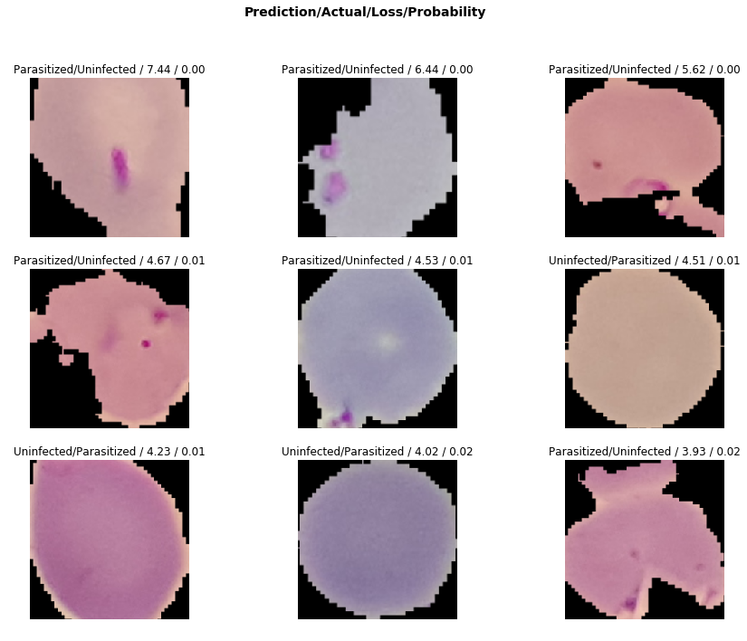

# Malaria Detection using Cell Images

This project aims to detect whether an image of a cell contains malaria or not using deep learning techniques. Malaria is a life-threatening disease caused by parasites that are transmitted to people through the bites of infected female Anopheles mosquitoes. It is preventable and curable. In 2017, there were an estimated 219 million cases of malaria in 90 countries. Malaria deaths reached 435,000 in 2017. The WHO African Region carries a disproportionately high share of the global malaria burden. In 2017, the region was home to 92% of malaria cases and 93% of malaria deaths. Malaria is caused by Plasmodium parasites. The parasites are spread to people through the bites of infected female Anopheles mosquitoes, called "malaria vectors." There are 5 parasite species that cause malaria in humans, and 2 of these species – P. falciparum and P. vivax – pose the greatest threat.

## Diagnosis of malaria can be difficult

Where malaria is not endemic anymore (such as in the United States), health-care providers may not be familiar with the disease. Clinicians seeing a malaria patient may forget to consider malaria among the potential diagnoses and not order the needed diagnostic tests. Laboratorians may lack experience with malaria and fail to detect parasites when examining blood smears under the microscope. Malaria is an acute febrile illness. In a non-immune individual, symptoms usually appear 10–15 days after the infective mosquito bite. The first symptoms – fever, headache, and chills – may be mild and difficult to recognize as malaria. If not treated within 24 hours, P. falciparum malaria can progress to severe illness, often leading to death.

## ResNet and residual learning

ResNet is a short name for a residual network, but what’s residual learning? Deep convolutional neural networks have achieved the human-level image classification result. Deep networks extract low, middle, and high-level features and classifiers in an end-to-end multi-layer fashion, and the number of stacked layers can enrich the “levels” of features. The stacked layer is of crucial importance, as shown by the ImageNet result.


## Dataset

The dataset used in this project can be downloaded from Kaggle: https://www.kaggle.com/iarunava/cell-images-for-detecting-malaria

## Approach

### Data processing & Exploratory Data Analysis

1. Import Libraries
2. Loading and processing data
3. Use ResNet34 Pre-trained model
4. Confusion Matrix
5. Test our model
6. Heatmaps

## Results

### Sample Labelled Images


### ResNet-34 Model Learning Rate


### Model Learning Outcomes per epoch


### Loss Metrics


### Classification Interpretation from ResNet34 Learning



### Confusion Matrix


### Classification Outcome


### Heatmaps


## For further information

Please review the narrative of our analysis in [our jupyter notebook](./Malaria%20Detection%20using%20Cell%20Images%20Dataset.ipynb)

For any additional questions, please contact **shaileshettyd@gmail.com)

##### Repository Structure:

```
├── README.md                                                                                                   <- The top-level README for reviewers
├── Malaria%20Detection%20using%20Cell%20Images%20Dataset.ipynb                                                 <- Narrative documentation of analysis
├── https://www.kaggle.com/iarunava/cell-images-for-detecting-malaria                                           <- Dataset
└── images                                                                                                      <- generated from code
```
## Citing :

```
@misc{Shailesh:2020,
  Author = {Shailesh Dhama},
  Title = {Malaria-Detection-using-Cell-Images},
  Year = {2020},
  Publisher = {GitHub},
  Journal = {GitHub repository},
  Howpublished = {\url{https://github.com/ShaileshDhama/Malaria-Detection-using-Cell-Images}}
}
```
